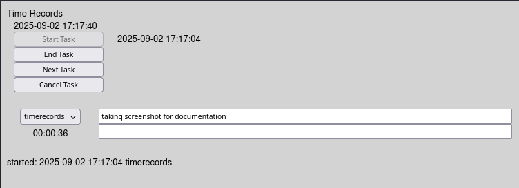

# timerecords

Simple Web Application to collect timesheet records, record in sqlite3 (can be switched to postgresql)



* uses sqlite3 for using a local database

* installation:
  * requires wt to be built and the resources directory be copied or linked in x64/web/
  * requires boost

* operation:
  * construct x64/timerecords.cfg with lines like:
```
account=cust1
account=cust2
account=project1
account=project2
account=break
```
  * start application
  * connect to http://localhost:8082

* for summaries in sqlite3:
  * sqlite3 x64/timerecords.db

```
sqlite> select code,dt_start, dt_end,(julianday(dt_end) - julianday(dt_start))*24*60 as duration, billing_text from task where code='timerecords' and dt_start > '2025-09-01 00:00:00' order by dt_start;
timerecords|2025-09-02T22:40:57.273|2025-09-02T22:41:35.631|0.63929982483387|updated to use config file
timerecords|2025-09-02T22:51:50.341|2025-09-02T22:52:45.333|0.916533619165421|adding to readme file
timerecords|2025-09-02T22:54:08.865|2025-09-02T22:55:02.845|0.899666547775269|testing summarization
sqlite> select sum(julianday(dt_end) - julianday(dt_start))*24*60  from task where code='timerecords' and dt_start > '2025-09-01 00:00:00';
2.45549999177456
sqlite> .quit
```

* the result is in minutes and fractional minute

